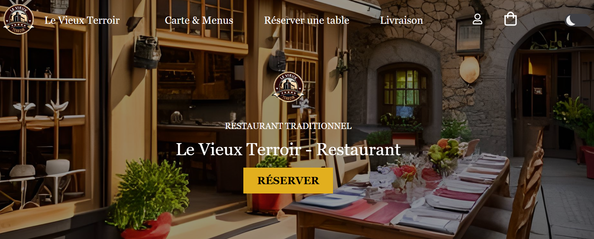
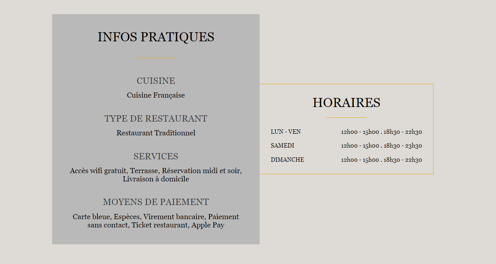
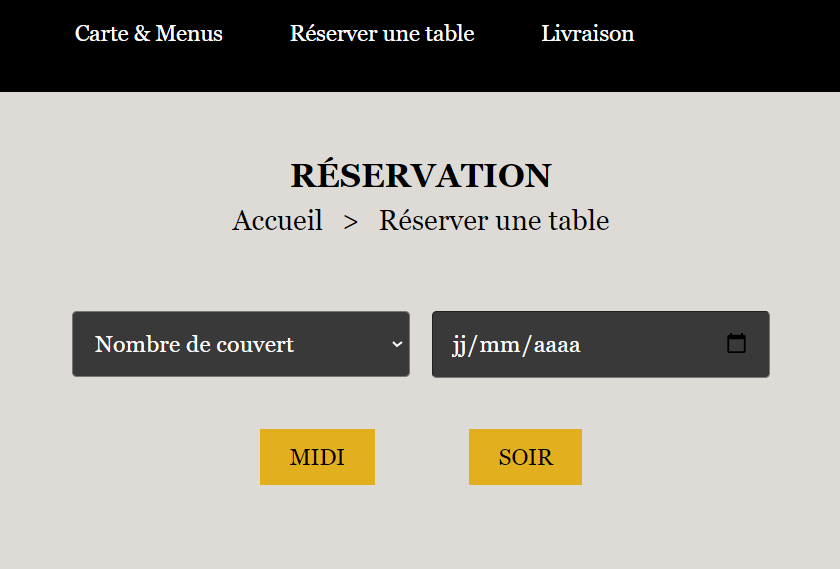
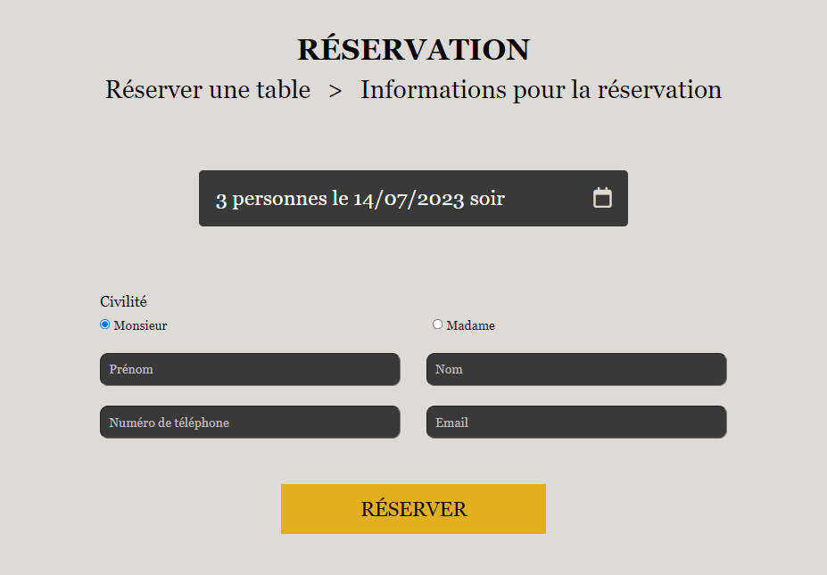
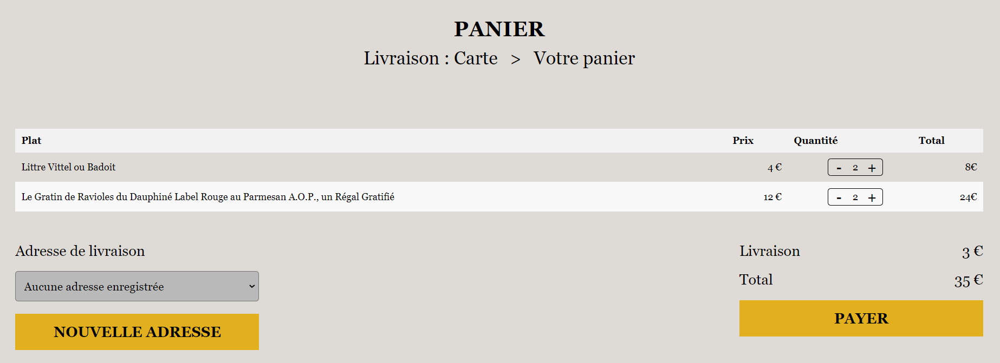
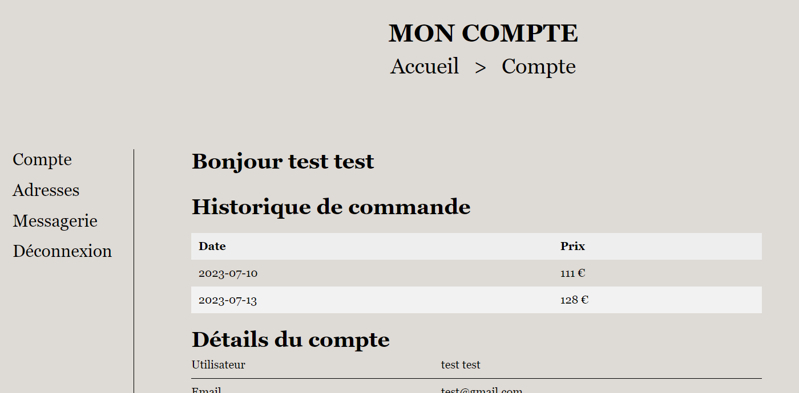
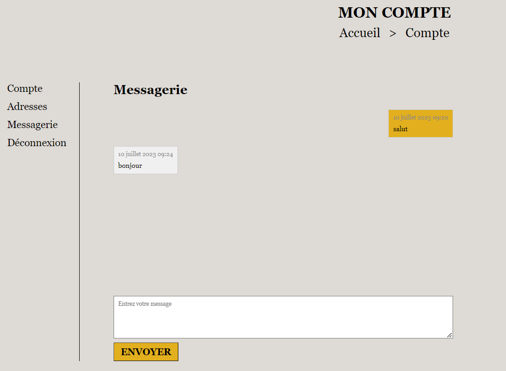
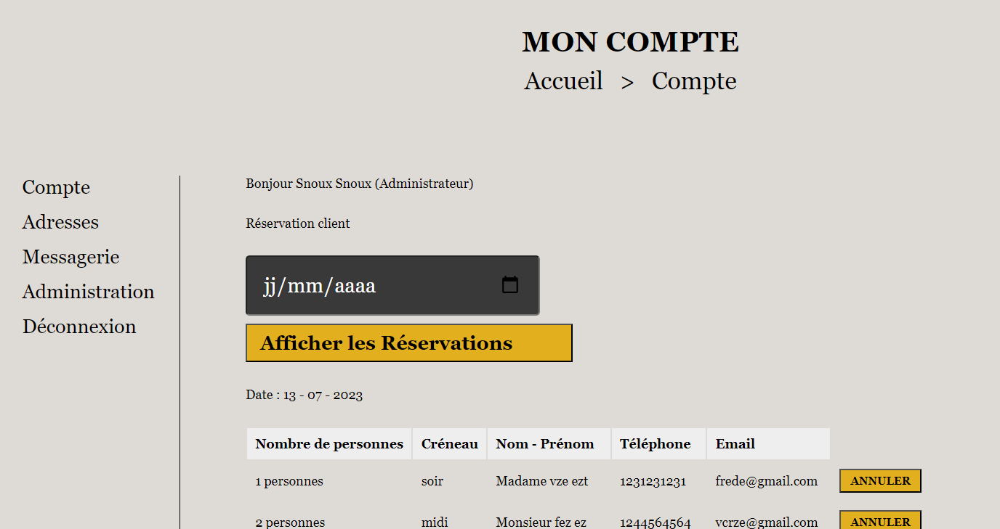
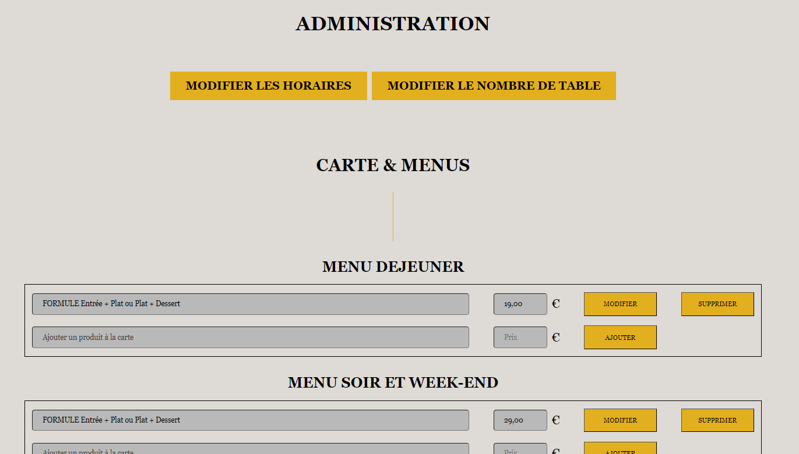
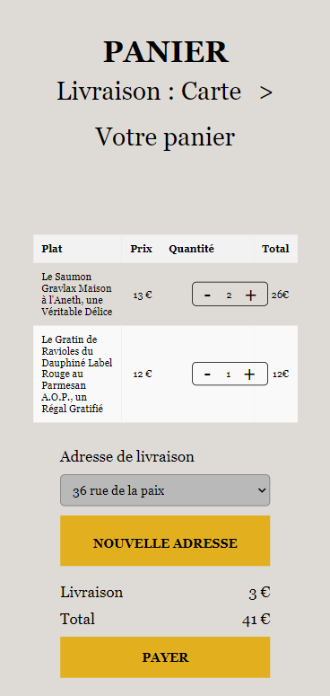

# Projet Site Restaurant (fictif)
 

    
 

  

    <a href="https://github.com/snoux/Projet-site-restaurant"><strong>Parcourir les documents »</strong></a>
     
     
  

## À propos du site

Site web du restaurant fictif "Le Vieux Terroir". Ce projet a été créé dans le but de fournir une plateforme en ligne permettant aux clients de découvrir le menu du restaurant, de réserver une table, de commander des plats à emporter et de communiquer avec le propriétaire du restaurant. L'administration du site est également prise en charge, offrant aux administrateurs la possibilité de gérer le menu, les horaires, le nombre de table, les réservations et les messages des clients.

 ## Accueil

 
La page d'accueil affiche les horaires d'ouverture du restaurant "Le Vieux Terroir". Les visiteurs peuvent consulter cette page pour connaître les heures d'ouverture et de fermeture du restaurant.

## Carte

La page "Carte" présente la carte du restaurant, où les clients peuvent découvrir les différents menus, plats et boissons proposés. Des descriptions sont incluses pour donner envie aux clients de venir déguster les spécialités du restaurant.

## Réservation

La page "Réservation" permet aux clients de réserver une table au restaurant sans avoir besoin de s'inscrire ou de se connecter. Les visiteurs peuvent choisir la date, la créneau (midi / soir) et le nombre de personnes pour leur réservation. Une fois leurs informations complétées et validées, une confirmation leur est affichée.

## Livraison à domicile / Panier et paiement

Les clients qui sont inscrits et connectés peuvent utiliser la page de livraison pour ajouter des produits de la carte au panier. Ils peuvent parcourir le menu, sélectionner les produits souhaités en choisissant les quantités.

La page du panier affiche un récapitulatif des articles ajoutés par le client. Les clients peuvent vérifier les détails de leur commande, les quantités et les prix. Lorsqu'ils sont prêts à finaliser la commande, ils peuvent procéder au paiement.

## Profil du client

La page de profil permet aux clients inscrits de consulter leur historique de commandes. Ils peuvent également voir les adresses enregistrées et utiliser la messagerie directe pour communiquer avec le propriétaire du restaurant.

## Interface d'administration

Les administrateurs du site ont accès à une interface d'administration dédiée. Cette interface leur permet de modifier la carte du restaurant en ajoutant, modifiant ou supprimant des menus, des plats et des boissons. Les administrateurs peuvent également gérer le nombre de tables disponibles et les horaires d'ouverture du restaurant. Ils peuvent consulter et répondre aux messages des clients via la messagerie. Le calendrier des réservations est également accessible aux administrateurs, leur permettant d'annuler des réservations si nécessaire.

## Responsivité

Site entièrement responsive pour pc, tablette et mobile

